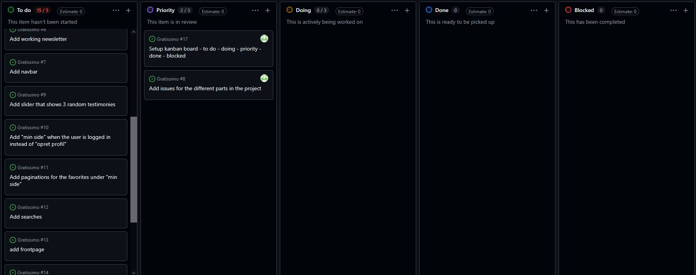
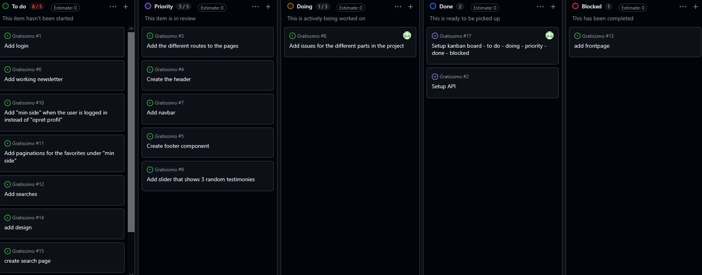
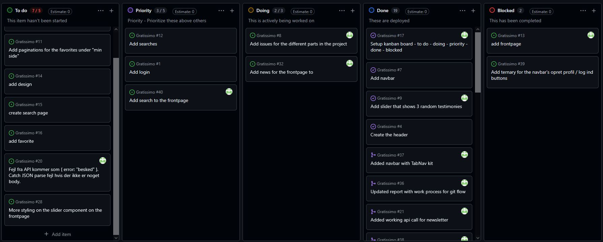
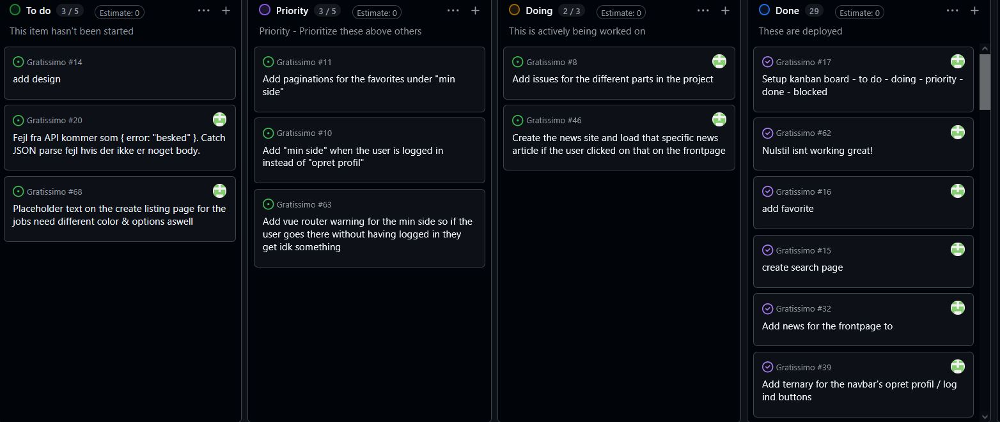
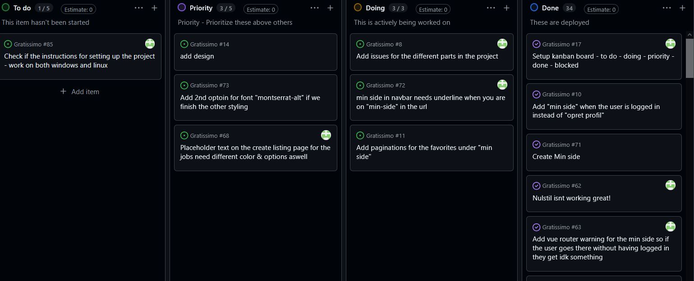
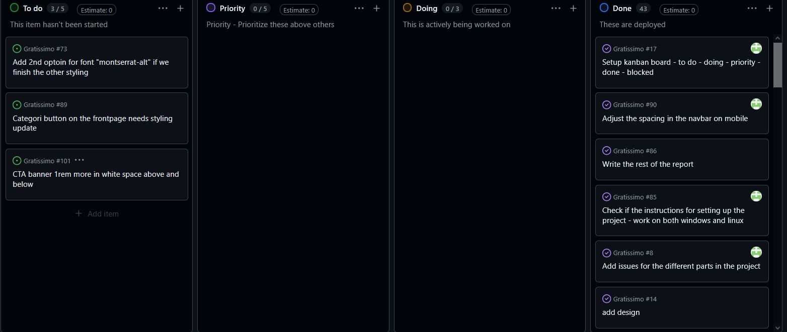

# Gratissimo — Projektrapport

**Søren Markussen Jensen** · Webudvikler · h1we080125 · September 2026

**GitHub:** https://github.com/NightsHigh/Gratissimo ·

**Login til test:** `info@webudvikler.dk` / `password`

**Github Kanban board:** https://github.com/users/NightsHigh/projects/5

En klon af jobindex for frivilligt arbejde. Vue 3 sammen med et meget lille component library.
Hovedopgaven er funktionelt komplet med minor styling choices missing, men alt funktionalitet og den valgrfie opgave hvor jeg valgte pagination er færdig lavet. 

---

**Kørsel af projektet:**
**Kørsel af projektet:**

``git clone git@github.com:NightsHigh/Gratissimo.git``

``cd Gratissimo``

**API:**

``cd API``

``cp .env.example .env``

``npm install``

``npm run migrate``

``npm run generate ``

``npm run dev``

**Frontend:**
I en ny terminal:

``cd Gratissimo``

Din terminal burde se sådan her ud nu: ``Gratissimo\Gratissimo> ``

Så længe du er i Gratissimo -> Gratissimo kan du køre de næste commands

``npm install``

``cp .env.example .env ``

``npm run dev``

---
``git clone git@github.com:NightsHigh/Gratissimo.git``

``cd Gratissimo``

**API:**

``cd API``

``cp .env.example .env``

``npm install``

``npm run migrate``

``npm run generate ``

``npm run dev``

**Frontend:**
I en ny terminal:

``cd Gratissimo``

Din terminal burde se sådan her ud nu: ``Gratissimo\Gratissimo> ``

Så længe du er i Gratissimo -> Gratissimo kan du køre de næste commands

``npm install``

``cp .env.example .env ``

``npm run dev``

---

## Vurdering af egen indsats

Jeg nåede selve hovedopgaven og den valgfrie opgave, hvor jeg valgte pagination. 

Jeg gjorde en stor indsats i version control og i at køre et kanban board. Det gjorde også, at jeg fik en del flere commits, men også vigtigere gav det mig kendskab til industri standarden med flow metoder som fx main og dev, men også fx hvad at prioritere i issues og coding, det kan ses på kanban board billederne i bilaget.

**Med mere tid:**
**Med mere tid:**

Fix de resterende styling issues og få styr på noget mere af vue generelt, da jeg stadig er meget ny i Vue iforhold til React.

## Argumentation for de valg du har truffet under løsningen af opgaven

**Ingen state management library**
Appen bruger en delt tilstand om brugeren er logget ind. Vi bruger en ref i auth.js, alle filer der importerer den bruger den samme ref.
Vi slipper for at bruge pinia, da jeg stadig ikke er bekendt med det, og at vi ikke skal være depended på et outside library hvis vi kan have det in house.

**Filtrering i browseren.**
API'et har intet mine-annoncer endpoint så vi var nødt til a hente alle annoncer og filtre dem for hvilke brugeren har oprettet selv.
Ville have brugt et endpoint i API'et hvis vi havde et rigtigt API / I industri produktion ville jeg have gjort det eller lavet et kort i backend kanban boardet.

### Redegørelse af de forskellige kodeelementer i prøven

Component library ``src/kit`` fra tidligere eksamensprojekter. Designet er udleveret som et figma design og API'et var udleveret af læren.

#### Rettelse i API'et:
Jeg valgte at fjerne authorize fra newsletter, da tilmeldingen til nyhedsbrevet står i footeren på alle siderne, det står også for folk der ikke er logget ind. Jeg fjernede authorize fra newsletter i API/src/routes/newsletterSubscriberRoutes.ts

Jeg satte et extra input på opret-profil formen, da API'et kræver en zipcode når man opretter en bruger, men i postman documentationen står der at det var valgri men API'et kræver zipcode med når du skal oprette den bruger.

Jeg har brugte følgene kilder til henholdsvis regex / box shadows / vue router

#### Kilder:

Jeg har brugte følgene kilder til henholdsvis regex / box shadows / vue router

* Regex snippets: https://regex-snippets.com
* Box shadow: https://getcssscan.com/css-box-shadow-examples
* Vue router: https://router.vuejs.org/guide/advanced/navigation-guards.html
* Vue router meta: https://v3.router.vuejs.org/guide/advanced/meta.html

## Fremhævelse af punkter til bedømmelse
Udover min gennemgang af projektet vil jeg gå komme ind på disse:

* Hvornår et component hører til component library frem for appen.
* Slots frem for props og hvornår man skal bruge hver.
* Hvorfor Vue istedet for React
* Composition API frem for Options API

### Arbejdsproces

**Kanban med To Do - Priority - Doing - Done - Blocked** 
Jeg brugte git flow for arbejdsprocess, så main <- dev <- feature/hotfix

Jeg brugte dog mest main/dev/feature branches og enkelte hotfix branches.

---

## Bilag: Kanban Board Work Tracking

### Mandag

### Tirsdag

### Onsdag

### Torsdag

### Fredag

